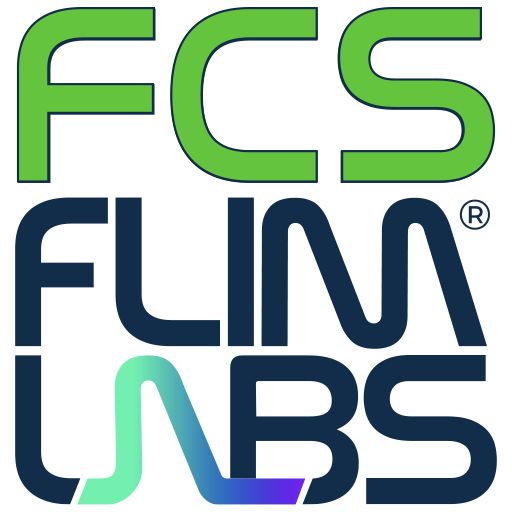

<a name="readme-top"></a>

<!-- PROJECT LOGO -->

<div align="center">
  <h1>FCS</h1>
</div>
<div align="center">
  <a href="https://www.flimlabs.com/">
    
  </a>
</div>
<br>


<!-- TABLE OF CONTENTS -->
<details>
  <summary>Table of Contents</summary>
  <ol>
    <li>
      <a href="#about-the-project">About The Project</a>
      <ul>
        <li><a href="#built-with">Built With</a></li>
      </ul>
    </li>
    <li>
      <a href="#getting-started">Getting Started</a>
      <ul>
        <li><a href="#prerequisites">Prerequisites</a></li>
        <li><a href="#installation">Installation</a></li>
      </ul>
    </li>
    <li><a href="#usage-guides">Usage Guides</a></li>
    <li><a href="#license">License</a></li>
    <li><a href="#contact">Contact</a></li>
  </ol>
</details>


<!-- ABOUT THE PROJECT -->
## About The Project

Welcome to [FCS (Fluorescence Correlation Spectroscopy)](https://github.com/flim-labs/fcs-py), a Python application designed for in-depth **Fluorescence Correlation Spectroscopy (FCS) analysis**. The software specializes in advanced post-processing techniques, focusing on computing correlations (both **auto** and **cross**) between intensity vectors. With support for **multi-acquisitions** to calculate **averaged correlations**, users can delve into intricate molecular dynamics and interactions with ease. The intuitive graphical user interface (GUI) provides seamless navigation through these analytical functions, enabling users to explore FCS data comprehensively.

<p align="right">(<a href="#readme-top">back to top</a>)</p>


### Built With

* [Python](https://www.python.org/)
* [PyQt6](https://pypi.org/project/PyQt6/)
* [pyqtgraph](https://www.pyqtgraph.org/)
* [matplotlib](https://pypi.org/project/matplotlib/)
* [flim-labs](https://pypi.org/project/flim-labs/)

<p align="right">(<a href="#readme-top">back to top</a>)</p>


<!-- GETTING STARTED -->
## Getting Started
To directly test the application, skipping the installation requirements you can download an installer at this [link](https://github.com/flim-labs/fcs-py/releases/tag/v1.4) (_Note: you still need to have the FLIM LABS Data Acquisition Card_). 

To get a local copy up and running follow these steps.

### Prerequisites

To be able to run this project locally on your machine you need to satisfy these requirements:
* Windows OS (>= Windows 10)
* 4GB RAM
* Multicore CPU
* Python version >= 3.8
* Possess a [FLIM LABS Data Acquisition Card](https://www.flimlabs.com/products/data-acquisition-card/) to be able to acquire your data
* FLIM LABS Data Acquisition Card drivers installed [(download here)](https://flim-labs.github.io/flim-labs-drivers/data-acquisition-card-drivers/)


### Installation

1. Clone the repo
   ```sh
   git clone https://github.com/flim-labs/fcs-py.git
   ```
2. Set the virtual environment in the root folder
   ```sh
   python -m venv venv
   ```
3. Activate the virtual environment:
   ```sh
   venv\Scripts\activate 
   ```   
4. Install the dependencies
   ```sh
   pip install -r requirements.txt
   ```
5. Run the project
   ```sh
   python fcs.py
   ```  


<p align="right">(<a href="#readme-top">back to top</a>)</p>


## Usage Guides

Navigate to the following links to view detailed application usage guides:

- [FCS GUI guide](./v1.4/index.md)
- [FCS Data export guide](./python-flim-labs/fcs-file-format.md)


<p align="right">(<a href="#readme-top">back to top</a>)</p>


## License

Distributed under the MIT License.

<p align="right">(<a href="#readme-top">back to top</a>)</p>


<!-- CONTACT -->
## Contact

FLIM LABS: info@flimlabs.com

Project Link: [FCS (Fluorescence Correlation Spectroscopy)](https://github.com/flim-labs/fcs-py)

<p align="right">(<a href="#readme-top">back to top</a>)</p>


