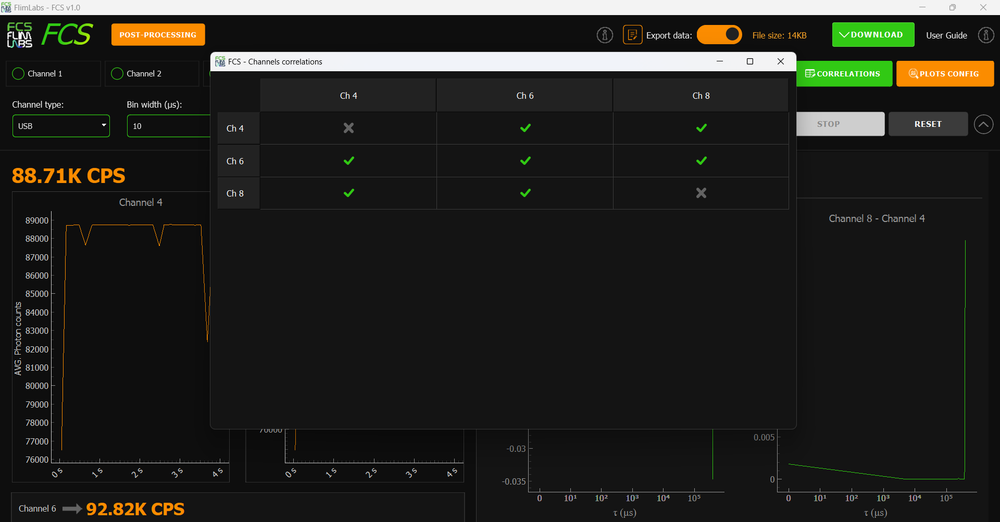

<a name="readme-top"></a>

<div align="center">
  <h1>FCS v1.0</h1>
</div>
<div align="center">
  <a href="https://www.flimlabs.com/">
    
  </a>
</div>
<br>

<!-- TABLE OF CONTENTS -->
<details>
  <summary>Table of Contents</summary>
  <ol>
    <li>
      <a href="#introduction">Introduction</a>
    </li>
    <li><a href="#gui-usage">GUI Usage</a>
    <ul>
    <li><a href="#acquisition-channels">Acquisition channels</a></li>
    <li><a href="#connection-type">Connection type</a></li>
    <li><a href="#correlations">Correlations</a></li>
    <li><a href="#bin-width">Bin width</a></li>
    <li><a href="#acquisition-mode">Acquisition mode</a></li>
    <li><a href="#acquisition-time">Acquisition time</a></li>
    <li><a href="#averages">Averages</a></li>
    <li><a href="#time-span">Time span</a></li>
    <li><a href="#export-data">Export data</a></li>
    <li><a href="#download-scripts-and-data-files">Download scripts and data files</a></li>
    <li><a href="#parameters-table-summary">Parameters table summary</a></li>
    </ul>
    </li>
    <li><a href="#parameters-configuration-saving">Parameters Configuration Saving</a></li>
    <li><a href="#plots-configuration">Plots Configuration</a></li>
     <li><a href="#exported-data-visualization">Exported Data Visualization</a></li>
     <li><a href="#download-acquired-data">Download Acquired Data</a></li>
    <li><a href="#license">License</a></li>
    <li><a href="#contact">Contact</a></li>
  </ol>
</details>

<!-- ABOUT THE PROJECT -->

## Introduction

Welcome to [FCS (Fluorescence Correlation Spectroscopy)](https://github.com/flim-labs/fcs-py) _v1.0_ usage guide. In this documentation section, you will find all the necessary information for the proper use of the application's **graphical user interface** (GUI).
For a general introduction to the aims, technical requirements and installation of the project, read the [FCS Homepage](../index.md). You can also follow the [Data export](../python-flim-labs/fcs-file-format.md) dedicated guide link.

<p align="right">(<a href="#readme-top">back to top</a>)</p>

<!-- USAGE EXAMPLES -->

## GUI Usage


The GUI offers advanced parameter configuration functionalities for real-time acquisition of photon intensity traces and subsequent computation of their **G(<span style="font-family: Times New Roman">τ</span>) correlations** during post-processing. With the ability to enable from _1_ to _8_ channels simultaneously and configure the desired number and type of correlations (`auto` and `cross`) between channels, the software can calculate up to a total of `64` correlation functions (G(<span style="font-family: Times New Roman">τ</span>)). Let's delve into the configurable parameters in detail:

#### Acquisition channels

The software allows for data acquisition in **single-channel** or **multi-channel** mode, with the user able to activate up to _8_ channels simultaneously.

To start acquisition, at least one channel must be activated.

_Note: Ensure that the channel activated in the software corresponds to the channel number being used for acquisition on the [FLIM LABS Data Acquisition Card](https://www.flimlabs.com/products/data-acquisition-card/)._

<hr>

#### Connection type

The user can choose the type of connection for data acquisition between **SMA** and **USB** connections.

_Note: The connection type set in the software must match the actual connection type activated on the [FLIM LABS Data Acquisition Card](https://www.flimlabs.com/products/data-acquisition-card/)._

<hr>

#### Correlations



The software provides a guided user interface for selecting **correlations between channels**, and thus between photon intensity vectors, on which to perform post-processing and **calculate G(<span style="font-family: Times New Roman">τ</span>) correlation functions**. Users can choose to set both `auto-correlations` (a channel correlated with itself) and `cross-correlations` (correlations between different channels). If the user selects a cross-correlation, for example, between channel 6 and channel 8, the reverse correlation (between channel 8 and channel 6) will be automatically set as well. With the ability to activate up to 8 acquisition channels simultaneously, it is possible, by activating all possible correlations, to calculate up to a total of _64_ correlation functions.


<hr>

#### Bin width

The user can set a **bin width** choosing between _1_, _10_, _100_ and _1000_ values (μs). Bin width represents the duration of time to wait for accumulating photon counts in the exported data file. In the interface plots, this value is adjusted to maintain real-time visualization.

<hr>

#### Acquisition mode

Users can choose between two data acquisition modes: **free running** or **fixed acquisition time**.

In free running mode, the total acquisition time is _not specified_. If users deactivate free running mode, they must set a specific acquisition time value.

If the user chooses the free-running mode, he cannot specify a value for the _averages_ input (number of acquisitions). Thus, this input will automatically be set to 1.

<hr>

#### Acquisition time

When the free running acquisition mode is disabled, users must specify the **acquisition time** parameter to set the total data acquisition duration. Users can choose a value between _1_ and _1800_ s (seconds).

For example, if a value of 10 is set, the acquisition will stop after 10 seconds.

<hr>

#### Averages

The input **#averages** allows the user to specify the **total number of acquisitions** to be performed, choosing from a range of _1_ to _10_. This value is configurable only if the _free-running mode is disabled and a specific value for the acquisition time is set_. For instance, if the user chooses to conduct 5 acquisitions with an acquisition time of 1 minute, 5 acquisitions of 1-minute duration will be sequentially executed, with a small delay between them. 

During FCS post-processing, for each channel pair where a correlation is set, as many G(<span style="font-family: Times New Roman">τ</span>) functions will be calculated as there were acquisitions. The **mean of these G(<span style="font-family: Times New Roman">τ</span>)** functions will then be computed, representing the final trace visualized on the G(<span style="font-family: Times New Roman">τ</span>) plots. 

_Note: individual G(<span style="font-family: Times New Roman">τ</span>) functions, along with the mean, can be further analyzed outside the GUI by enabling the data export feature._

<hr>

#### Time span

**Time span** set the time interval, in seconds, for the _last visible data range on the duration x-axis_. For instance, if this value is set to 5s, the x-axis will scroll to continuously display the latest 5 seconds of real-time data on the chart.
Users can choose a value from _1_ to _300_ s (seconds).

<hr>


#### Export data

Users can choose to **export FCS post-processing data** in _.bin_ file format for further analysis.
Refers to this sections for more details:

- [Export Data](#export-data)
- [FCS Data Export guide ](../python-flim-labs/fcs-file-format.md)

<hr>

#### Download scripts and data files

If the _Export data_ option is enabled, the **download** button allows users to download, in a single action, the _.bin file_ containing the FCS post-processing information and two scripts (_Python_ and _Matlab_) for manipulating and displaying G(<span style="font-family: Times New Roman">τ</span>) vectors in graphical form.

Note: If the user chooses to download the "Python" script, a _requirements.txt_ file - indicating the dependencies to install for running the script - will be automatically downloaded as well.

Refers to this sections for more details:

- [Download Acquired Data](#download-acquired-data)
- [FCS Data Export guide ](../python-flim-labs/fcs-file-format.md)

<hr>

#### Parameters table summary

Here a table summary of the configurable parameters:

|                                 | data-type   | config                                                                                                                     | default   | explanation                                                                                                                                         |
| ------------------------------- | ----------- | -------------------------------------------------------------------------------------------------------------------------- | --------- | --------------------------------------------------------------------------------------------------------------------------------------------------- |
| `enabled_channels`              | number[]    | set a list of enabled acquisition data channels (up to 8). e.g. [0,1,2,3,4,5,6,7]                                          | []        | the list of enabled channels for photons data acquisition                                                                                           |
| `selected_conn_channel`         | string      | set the selected connection type for acquisition (USB or SMA)                                                              | "USB"     | If USB is selected, USB firmware is automatically used. If SMA is selected, SMA firmware is automatically used.   
| `correlations`                      | list of tuples     | Set the list of correlations between couple of channels (from 1 to 64 correlations)                                      | []     |   |                                  |
| `bin_width_micros`              | number      | Set the numerical value in microseconds. Range: _1-1000µs_                                                              | 10 (µs) | the time duration to wait for photons count accumulation.                                                                                           |
| `free_running_acquisition_time` | boolean     | Set the acquisition time mode (_True_ or _False_)                                                                          | True      | If set to True, the _acquisition_time_millis_ is indeterminate. If set to False, the acquisition_time_millis param is needed (acquisition duration) |
| `time_span`                     | number      | Time interval, in seconds, for the visible data range on the duration x-axis. Range: _1-300s_                              | 5         | For instance, if `time_span` is set to _5s_, the _x-axis_ will scroll to continuously display the latest 5 seconds of real-time data on the chart   |
| `acquisition_time_millis`       | number/None | Set the data acquisition duration. Range: _1-1800s_                                                                        | None      | The acquisition duration is indeterminate (None) if _free_running_acquisition_time_ is set to True.                                                 |
| `write_data`                    | boolean     | Set export data option to True/False                                                                                       | False     | if set to _True_, the FCS post-processing raw data will be exported locally to the computer                                                                    |
| `#averages`                      | number     | Set the number of acquisitions                                             | 1     | Configurable only if free running mode is deactivated   |


<br/>


### Parameters Configuration Saving

The saving of GUI configuration parameters is **automated**. Each interaction with the parameters results in the relative value change being stored in a `settings.ini` internal file.

The configurable parameters which can be stored in the settings file include:

- `enabled_channels`
- `selected_conn_channel`
- `selected_firmware`
- `bin_width_micros`
- `time_span`
- `acquisition_time_millis`
- `free_running_acquisition_time`
- `write_data`
- `averages`
- `ch_correlation`
- `gt_plots_to_show`
- `intensity_plots_to_show`


On application restart, the saved configuration is automatically loaded. If the `settings.ini` file is not found, or a specific parameter has not been configured yet, a default configuration will be set.

Here an example of the `settings.ini` structure:

```json
ch_correlations="[[3, 3, false], [3, 5, true], [3, 7, true], [5, 3, true], [5, 5, true], [5, 7, true], [7, 3, true], [7, 5, true], [7, 7, false]]"
gt_plots_to_show="[[3, 3], [3, 7], [7, 3], [7, 7]]"
intensity_plots_to_show="[3, 7]"
enabled_channels="[3, 5, 7]"
write_data=true
bin_width_micros=10
free_running_mode=false
acquisition_time_millis=4000
averages=2
```

<p align="right">(<a href="#readme-top">back to top</a>)</p>


## Plots Configuration


The software provides users with the flexibility to **configure the visualization of plots**, avoiding cluttering the GUI and facilitating the analysis process.

The central part of the interface is divided into two sections:
- The left section displays `real-time acquired photon intensity data` (either in plot format or showing only the CPS - average counts per second).
- The right section displays, after the post-processing of intensity data, the `plots related to the calculated G(τ) functions` based on the set correlations. More in details:
    - The **Y-axis** represents the values of the _G(<span style="font-family: Times New Roman">τ</span>) correlation_.
    - The **X-axis** represents the lag index or _tau_ (in microseconds) used for correlation calculation.
Users can choose to display up to a maximum of _4_ intensity tracing plots (the remaining acquisitions, if any, will be shown in CPS format) and a maximum of _4_ G(<span style="font-family: Times New Roman">τ</span>) plots.

_Note: the graphs of all calculated G(<span style="font-family: Times New Roman">τ</span>) functions will always be visible in the resulting .bin file if the export data feature is activated._


## Exported Data Visualization

The application GUI allows the user to export the FCS post-processing data in `binary file format`.

The user can also preview the approximate final file size on the GUI.
The final size depends on the **number of activated correlations** (and so on the correlations functions vectors calculated ) and on the **length of user notes** added to the .bin header. 

For a detailed guide about data export and binary file structure see:

- [FCS Data Export guide ](../python-flim-labs/fcs-file-format.md)

<p align="right">(<a href="#readme-top">back to top</a>)</p>

## Download Acquired Data

Besides the [Exported Data Visualization](#exported-data-visualization) feature, users can download FCS post-processing data and its reader file by clicking the `DOWNLOAD` button in the top-right corner of the GUI.

During the download, users need to choose the preferred reader file format (`MATLAB` (.m) or `Python` (.py)) and specify a directory for saving both the `.bin` file and its corresponding reader file. It's important to provide a specific name before completing the save operation.

After downloading, visualize the raw data by running the saved script (reader file). This script reads binary data from the locally stored file and uses the [matplotlib](https://matplotlib.org/) library to create a graphical representation of the G(<span style="font-family: Times New Roman">τ</span>) vectors.

For more details on how to run the saved script. data export and binary file structure and refer to: [FCS Data Export guide ](../python-flim-labs/fcs-file-format.md)

<p align="right">(<a href="#readme-top">back to top</a>)</p>

## License

Distributed under the MIT License.

<p align="right">(<a href="#readme-top">back to top</a>)</p>

<!-- CONTACT -->

## Contact

FLIM LABS: info@flimlabs.com

Project Link: [FCS (Fluorescence Correlation Spectroscopy)](https://github.com/flim-labs/fcs-py)


<p align="right">(<a href="#readme-top">back to top</a>)</p>
