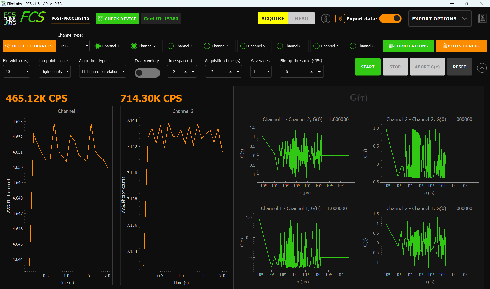
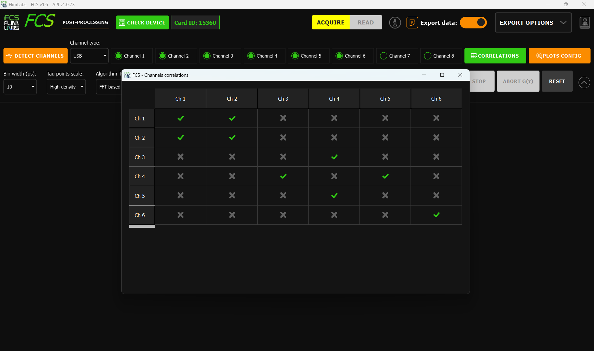
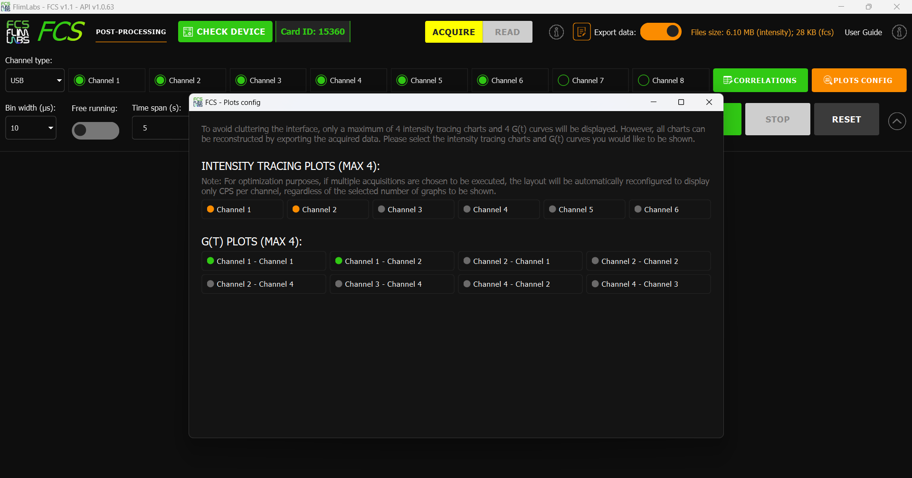

<a name="readme-top"></a>

<div align="center">
  <h1>FCS v1.6</h1>
</div>
<div align="center">
  <a href="https://www.flimlabs.com/">
    
  </a>
</div>
<br>

<!-- TABLE OF CONTENTS -->
<details>
  <summary>Table of Contents</summary>
  <ol>
    <li>
      <a href="#introduction">Introduction</a>
    </li>
    <li><a href="#gui-usage">GUI Usage</a>
    <ul>
    <li><a href="#acquisition-channels">Acquisition channels</a></li>
    <li><a href="#connection-type">Connection type</a></li>
    <li><a href="#correlations">Correlations</a></li>
    <li><a href="#bin-width">Bin width</a></li>
      <li><a href="#tau-points-scale">Tau points scale</a></li>
    <li><a href="#acquisition-mode">Acquisition mode</a></li>
    <li><a href="#acquisition-time">Acquisition time</a></li>
    <li><a href="#averages">Averages</a></li>
    <li><a href="#time-span">Time span</a></li>
    <li><a href="#cps-threshold">CPS Threshold</a></li>
    <li><a href="#card-connection-detection">Card Connection Detection</a></li>
        <li><a href="#channels-connections-detection">Channels Connections Detection</a></li>
    <li><a href="#export-data">Export data</a></li>
    <li><a href="#parameters-table-summary">Parameters table summary</a></li>
    </ul>
    </li>
    <li><a href="#parameters-configuration-saving">Parameters Configuration Saving</a></li>
    <li><a href="#plots-configuration">Plots Configuration</a></li>
     <li><a href="#exported-data-visualization">Exported Data Visualization</a></li>
     <li><a href="#download-acquired-data">Download Acquired Data</a></li>
    <li><a href="#license">License</a></li>
    <li><a href="#contact">Contact</a></li>
  </ol>
</details>

<!-- ABOUT THE PROJECT -->

## Introduction

Welcome to [FCS (Fluorescence Correlation Spectroscopy)](https://github.com/flim-labs/fcs-py) _v1.6_ usage guide. In this documentation section, you will find all the necessary information for the proper use of the application's **graphical user interface** (GUI).
For a general introduction to the aims, technical requirements and installation of the project, read the [FCS Homepage](../index.md). You can also follow the [Data export](../python-flim-labs/fcs-file-format.md) dedicated guide link.

<p align="right">(<a href="#readme-top">back to top</a>)</p>

<!-- USAGE EXAMPLES -->

## GUI Usage



The GUI offers advanced parameter configuration functionalities for real-time acquisition of photon intensity traces and subsequent computation of their **G(<span style="font-family: Times New Roman">τ</span>) correlations** during post-processing. With the ability to enable from _1_ to _8_ channels simultaneously and configure the desired number and type of correlations (`auto` and `cross`) between channels, the software can calculate up to a total of `64` correlation functions (G(<span style="font-family: Times New Roman">τ</span>)). Let's delve into the configurable parameters in detail:

#### Acquisition channels

The software allows for data acquisition in **single-channel** or **multi-channel** mode, with the user able to activate up to _8_ channels simultaneously.

To start acquisition, at least one channel must be activated.

_Note: Ensure that the channel activated in the software corresponds to the channel number being used for acquisition on the [FLIM LABS Data Acquisition Card](https://www.flimlabs.com/products/data-acquisition-card/)._

<hr>

#### Connection type

The user can choose the type of connection for data acquisition between **SMA** and **USB** connections.

_Note: The connection type set in the software must match the actual connection type activated on the [FLIM LABS Data Acquisition Card](https://www.flimlabs.com/products/data-acquisition-card/)._

<hr>

#### Correlations



The software provides a guided user interface for selecting **correlations between channels**, and thus between photon intensity vectors, on which to perform post-processing and **calculate G(<span style="font-family: Times New Roman">τ</span>) correlation functions**. Users can choose to set both `auto-correlations` (a channel correlated with itself) and `cross-correlations` (correlations between different channels). If the user selects a cross-correlation, for example, between channel 6 and channel 8, the reverse correlation (between channel 8 and channel 6) will be automatically set as well. With the ability to activate up to 8 acquisition channels simultaneously, it is possible, by activating all possible correlations, to calculate up to a total of _64_ correlation functions.


<hr>

#### Bin width

The user can set a **bin width** choosing between _1_, _10_, _100_ and _1000_ values (μs). Bin width represents the duration of time to wait for accumulating photon counts in the exported data file. In the interface plots, this value is adjusted to maintain real-time visualization.

<hr>

#### Algorithm Type

The **Algorithm Type** parameter allows users to select which algorithm will be used for the calculation of the G(<span style="font-family: Times New Roman">τ</span>) correlation functions during FCS post-processing. Two options are available:

- **FFT-based correlation**: Utilizes the Fast Fourier Transform to efficiently compute the correlation function, especially suitable for long time series and large datasets. This method is generally faster and is recommended for most standard use cases.
- **Multiple-τ correlation**: Employs a multiple-tau algorithm, which is particularly useful for handling data with a wide range of time scales. This method can provide more flexibility in certain experimental scenarios and is a well-established approach in FCS analysis.

<hr>


#### Tau points scale

The **Tau points scale** parameter allows users to choose the **density of tau (lag index) points** used for correlation calculations and plot visualization. Two options are available:

_Low density_ (default): Produces a standard number of tau points, resulting in faster calculations and lighter plots. This is suitable for most use cases and is set as the default.

_High density_: Produces a much higher number of tau points, allowing for a more detailed and smoother visualization of the correlation function, especially useful for in-depth analysis. This option may require more computation time and memory.
On the backend, this selection determines which algorithm is used to generate the tau (lag index) vector.


<hr>


#### Acquisition time

Users can choose between two data acquisition modes: **free running** or **fixed acquisition time**.

If the user chooses the free-running mode, he cannot specify a value for the _averages_ input (number of acquisitions). Thus, this input will automatically be set to 1.

When the free running acquisition mode is disabled, users must specify the **acquisition time** parameter to set the total data acquisition duration. Users can choose a value between _1_ and _1800_ s (seconds).

For example, if a value of 10 is set, the acquisition will stop after 10 seconds.

<hr>

#### Averages

The input **#averages** allows the user to specify the **total number of acquisitions** to be performed, choosing from a range of _1_ to _10_. This value is configurable only if the _free-running mode is disabled and a specific value for the acquisition time is set_. For instance, if the user chooses to conduct 5 acquisitions with an acquisition time of 1 minute, 5 acquisitions of 1-minute duration will be sequentially executed, with a small delay between them. 

During FCS post-processing, for each channel pair where a correlation is set, as many G(<span style="font-family: Times New Roman">τ</span>) functions will be calculated as there were acquisitions. The **mean of these G(<span style="font-family: Times New Roman">τ</span>)** functions will then be computed, representing the final trace visualized on the G(<span style="font-family: Times New Roman">τ</span>) plots. 

_Note: individual G(<span style="font-family: Times New Roman">τ</span>) functions, along with the mean, can be further analyzed outside the GUI by enabling the data export feature._

<hr>

#### CPS threshold

Users can set a numeric value for the **Pile-up threshold (CPS)** input to highlight it in red with a vibrant effect when the CPS for a specific channel _exceeds that threshold_.

<hr>

#### Time span

**Time span** set the time interval, in seconds, for the _last visible data range on the duration x-axis_. For instance, if this value is set to 5s, the x-axis will scroll to continuously display the latest 5 seconds of real-time data on the chart.
Users can choose a value from _1_ to _300_ s (seconds).

<hr>

#### Card Connection Detection

Since version _1.1_, the software supports **automatic detection of the Flim Card connection**.
The detection is performed automatically when the app starts and when acquisition begins. The user can also manually run this check at any time by clicking the _CHECK DEVICE_ button. If the card is connected, its ID will be displayed next to the button; otherwise, an error message will appear.

<hr>

#### Channels Connections Detection

Since version _1.2_, the software supports **automatic detection of channels connections**, simply clicking on the _Detect Channels_ button.
If connections are found, the system allows the user to update the configuration settings (Channel Type and enabled channels) in an automated way.

<hr>


#### Export data

Users can choose to **export FCS post-processing data** in _.bin_ and _.txt_ file format for further analysis. The FCS files are always downloaded if the export option is enabled.

Additionally, the user can select—via checkboxes in the export options—which supplementary files to download:

- **Intensity-tracing files**: These files contain the raw photon intensity traces used as the basis for FCS calculations. Selecting this option allows for further analysis or reprocessing of the original intensity data.
- **Time-tagger files**: If enabled, the software will also export the time-tagger data file, which is useful for advanced timing and synchronization analyses.

This flexible export system ensures that users can tailor the data download to their specific analysis needs, obtaining only the files relevant to their workflow.

Refer to this section for more details:

- [FCS Data Export guide ](../python-flim-labs/fcs-file-format.md)

<hr>


#### Parameters table summary

Here a table summary of the configurable parameters:

| Parameter | Data Type | Config | Default | Explanation |
|-----------|-----------|--------|---------|-------------|
| `enabled_channels` | number[] | set a list of enabled acquisition data channels (up to 8). e.g. [0,1,2,3,4,5,6,7] | [] | the list of enabled channels for photons data acquisition |
| `selected_conn_channel` | string | set the selected connection type for acquisition (USB or SMA) | "USB" | If USB is selected, USB firmware is automatically used. If SMA is selected, SMA firmware is automatically used. |
| `correlations` | list of tuples | Set the list of correlations between couple of channels (from 1 to 64 correlations) | [] | |
| `bin_width_micros` | number | Set the numerical value in microseconds. Range: _1-1000µs_ | 10 (µs) | the time duration to wait for photons count accumulation. |
| `fcs_algorithm` | string | Set the FCS algorithm to 'Multiple-τ correlation' or 'FFT-based correlation' | Multiple-τ correlation | Selects which algorithm is used to compute the G(τ) correlation functions: FFT-based is faster for large datasets, Multiple-τ is flexible for a wide range of time scales. |
| `tau_axis_scale` | string | Set the tau axis scale to 'Low density' or 'High density' | Low density | if set to _High density_, a much greater number of tau points will be calculated, providing a more detailed and smoother correlation curve |
| `free_running_acquisition_time` | boolean | Set the acquisition time mode (_True_ or _False_) | True | If set to True, the _acquisition_time_millis_ is indeterminate. If set to False, the acquisition_time_millis param is needed (acquisition duration) |
| `time_span` | number | Time interval, in seconds, for the visible data range on the duration x-axis. Range: _1-300s_ | 5 | For instance, if `time_span` is set to _5s_, the _x-axis_ will scroll to continuously display the latest 5 seconds of real-time data on the chart |
| `acquisition_time_millis` | number/None | Set the data acquisition duration. Range: _1-1800s_ | None | The acquisition duration is indeterminate (None) if _free_running_acquisition_time_ is set to True. |
| `write_data` | boolean | Set export data option to True/False | False | if set to _True_, the FCS post-processing raw data will be exported locally to the computer |
| `#averages` | number | Set the number of acquisitions | 1 | Configurable only if free running mode is deactivated |
| `cps_threshold` | number | Set the CPS threshold | 0 | If set to a value greater than 0, the user will see the CPS for each channel highlighted in red with a vibrant effect when they exceed the set threshold |
| `time_tagger` | boolean | Set export Time Tagger data option to True/False | True | if set to _True_, the Time Tagger data will be processed and exported locally to the computer (along with a reader script in Python) |

<br/>


### Parameters Configuration Saving

The saving of GUI configuration parameters is **automated**. Each interaction with the parameters results in the relative value change being stored in a `settings.ini` internal file.

The configurable parameters which can be stored in the settings file include:

- `enabled_channels`
- `selected_conn_channel`
- `selected_firmware`
- `bin_width_micros`
- `time_span`
- `acquisition_time_millis`
- `free_running_acquisition_time`
- `write_data`
- `fcs_algorithm`
- `tau_axis_scale`
- `averages`
- `ch_correlation`
- `gt_plots_to_show`
- `intensity_plots_to_show`
- `cps_threshold`


On application restart, the saved configuration is automatically loaded. If the `settings.ini` file is not found, or a specific parameter has not been configured yet, a default configuration will be set.

Here an example of the `settings.ini` structure:

```json
ch_correlations="[[3, 3, false], [3, 5, true], [3, 7, true], [5, 3, true], [5, 5, true], [5, 7, true], [7, 3, true], [7, 5, true], [7, 7, false]]"
gt_plots_to_show="[[3, 3], [3, 7], [7, 3], [7, 7]]"
intensity_plots_to_show="[3, 7]"
enabled_channels="[3, 5, 7]"
write_data=true
bin_width_micros=10
free_running_mode=false
acquisition_time_millis=4000
averages=2
cps_threshold=250000
tau_axis_scale=High density
fcs_algorithm=FFT-based correlation
```

<p align="right">(<a href="#readme-top">back to top</a>)</p>


## Plots Configuration



The software provides users with the flexibility to **configure the visualization of plots**, avoiding cluttering the GUI and facilitating the analysis process.

The central part of the interface is divided into two sections:
- The left section displays `real-time acquired photon intensity data` (either in plot format or showing only the CPS - average counts per second).
- The right section displays, after the post-processing of intensity data, the `plots related to the calculated G(τ) functions` based on the set correlations. More in details:
    - The **Y-axis** represents the values of the _G(<span style="font-family: Times New Roman">τ</span>) correlation_.
    - The **X-axis** represents the lag index or _tau_ (in microseconds) used for correlation calculation.
Users can choose to display up to a maximum of _4_ intensity tracing plots (the remaining acquisitions, if any, will be shown in CPS format) and a maximum of _4_ G(<span style="font-family: Times New Roman">τ</span>) plots.

_Note: the graphs of all calculated G(<span style="font-family: Times New Roman">τ</span>) functions will always be visible in the resulting .bin file if the export data feature is activated._


## Exported Data Visualization

The application GUI allows the user to export the FCS post-processing data in `binary file format`.

The user can also preview the approximate final file size on the GUI.
For a detailed guide about data export and binary file structure see:

- [FCS Data Export guide ](../python-flim-labs/fcs-file-format.md)

<p align="right">(<a href="#readme-top">back to top</a>)</p>

## Download Acquired Data

If the _Export data_ option is enabled, the acquisition .bin/.txt files and the **Python** and **Matlab** scripts for manipulating and displaying the acquired data are automatically downloaded at the end of the acquisition, after the user selects a name for the files.

Note: a requirements.txt file — indicating the dependencies needed to run the Python script -  will also be automatically downloaded.

For more details on how to run the saved script, data export and binary file structure refer to: [FCS Data Export guide ](../python-flim-labs/fcs-file-format.md)

<p align="right">(<a href="#readme-top">back to top</a>)</p>

## License

Distributed under the MIT License.

<p align="right">(<a href="#readme-top">back to top</a>)</p>

<!-- CONTACT -->

## Contact

FLIM LABS: info@flimlabs.com

Project Link: [FCS (Fluorescence Correlation Spectroscopy)](https://github.com/flim-labs/fcs-py)


<p align="right">(<a href="#readme-top">back to top</a>)</p>
